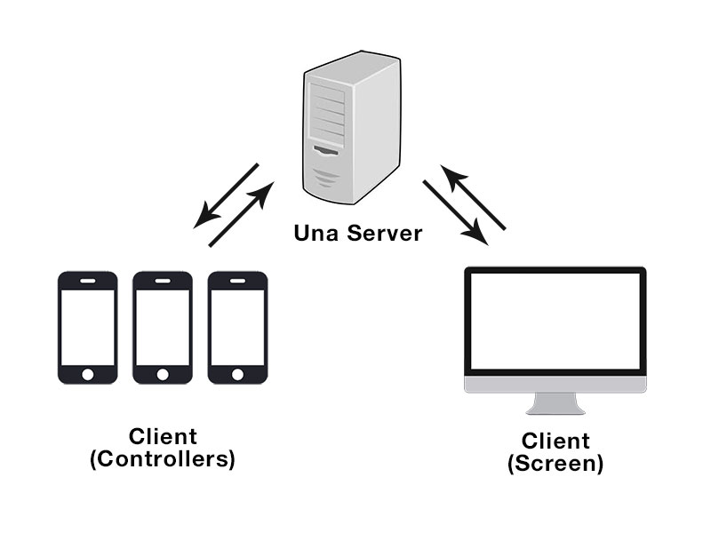

Quick Start
==

## Technological Overview

In Una, there are two kinds of clients:
- **Screen**: The centralized display that performs the bulk of the processing, usually accessed via a browser on a desktop/laptop.
- **Controller**: The medium for user input, usually accessed via a browser on a mobile device. 

The Una Server acts as a relay between the Screen and the Controller(s), passing messages between them. By
doing so, we can keep the Server footprint small with minimal processing, (as all we are doing is relaying messages between the Screen and Controller).



Both the Screen and the Controller comprises of client-side JavaScript code, and are connected
to the Server via websockets through socket.io. The Una Server is written in node.js.

Una makes it easy for you to write client-to-client code that is supported
via websockets, having you to write little, if any, server-side code.

## Una Server Installation

As Una is a node.js library, you will need to have node.js installed on your
server in order to use it. Follow the instructions below to install
node.js on your platform of choice.

Una is available as a package in npm. To install Una to your project, simply
type the following in shell:

```shell
npm install una
```

And you are done!

## The Una Server

### Installing
After installing Una, create an `app.js` file, which would be the starting point of
your node.js application. Type the following code:

```javascript
una = require('una');

una.listen(3216);
```

Run your node.js application in shell with:
```shell
$ node app.js
   info - socket.io started
   Una server listening on port 3216
```

Note: Una is built on top of express and socket.io, hence, these dependencies are automatically installed when you install Una.

`una.listen` takes in a port number, and creates a HttpServer listening on that
port number, running the express framework. In addition, it also launches the
socket.io client listening on the same port. To gain access to the express app
object and the socket.io io object, use the following code:

```javascript
// express app instance:
var app = una.app;

// socket.io io instance
var io = una.io;

// express library:
var express = una.express;
```

### Serving Static HTML Files

We want a way to serve static HTML files using the express framework. Modify `app.js` to the following:
```javascript
path = require('path');
una = require('una');

var app = una.app;
var express = una.express;

// Configure express to use the /public folder to serve static files
app.use(express.static(path.join(__dirname, 'public'));

una.listen(3216);
```

This will configure express to serve static files from the `/public` directory.
Since Una is a wrapper around express and socket.io, you may use the express
client to serve other routes that your application needs.

## Una Screen and Controller

### Room

In Una, rooms are thought of as collections of Screen and Controllers. 
The Screen and Controllers can only communicate with each
other if they are in the same room. You can think of a room as an instance
of a 'game', where there is one Screen which shows the state of that room,
and controllers which would be changing the state of the room by
sending messages to the Screen.

Note that in relay mode, there can only be **one** Screen active at any time
for each room.

### Installation

For your client side Una code, you would need to include the following 
javascript file in your HTML code:

```html
<script src='/socket.io/socket.io.js'></script>
<script src='/una_js/una.js'></script>
```

### Registration

You will need to identify whether the page is to be used as a Screen or as
a Controller, by calling the registration method. 

**Screen**

```javascript
var room_id = 'room1';
var screen_data = {name: 'screen'};
UnaScreen.register(room_id, screen_data, function(res) {
    if (res.success) {
        // Screen registered successfully
    } else {
        // Screen registration failed
    }
});
```

**Controller**

```javascript
var room_id = 'room1';
var controller_data = {name: 'player1'};
UnaController.register(room_id, controller_data, function(res) {
    if (res.success) {
        // Controller registered successfully
    } else {
        // Controller registration failed
    }
});
```

The first parameter of the register method is the room id, a unique string that identifies the room. 
The second parameter is the client data, and it can contain any Javascript object that will be used to identify this particular client.
All subsequent messages sent from the page will include this client data object for the receiver to identify the origin of the messages.


### Sending Data

To send data, use the following `sendTo` methods:

**Controller**

```javascript
UnaController.sendToScreen(event_key, data);
```

- **event_key** is a string, which the Screen will use to identify the type of `sendTo` event,
- **data**: A JavaScript object of the data to send to the screen.

**Screen**

```javascript
UnaScreen.sendToController(controller_id, event_key, {data: 'data'})
```

The Screen can also send data to a particular controller. **controller_id** is a string that can
be obtained from `res.una.id` of the controller when it was first registered,
or after an `onControllerInput` event.

### Receiving Data

To listen for data, use the following `onInput` methods:

**Controller**

```javascript
UnaController.onScreenInput(event_key, function(res) {
    // event_key: This string should correspond to the string passed in to the `sendToController` function from the Screen
    // res.una: Una header
    // res.una.user_data: The user data of the Screen sender
    // res.una.id: Unique id of the sender
    // res.payload: Payload object that was sent by the screen
});
```

**Screen**

```javascript
UnaScreen.onControllerInput(event_key, function(res) {
    // event_key: This string should correspond to the string passed in to the `sendToScreen` function from the Controller
    // res.una: Una header
    // res.una.user_data: The user data of the Controller sender
    // res.una.id: Unique id of the sender
    // res.payload: Payload object that was sent by the controller
});
```

`res.una` is the Una Header attached to every message, and contains:
- `user_data` that was supplied when the Screen/Controller was registered
- `id`, a unique id identifying the client

